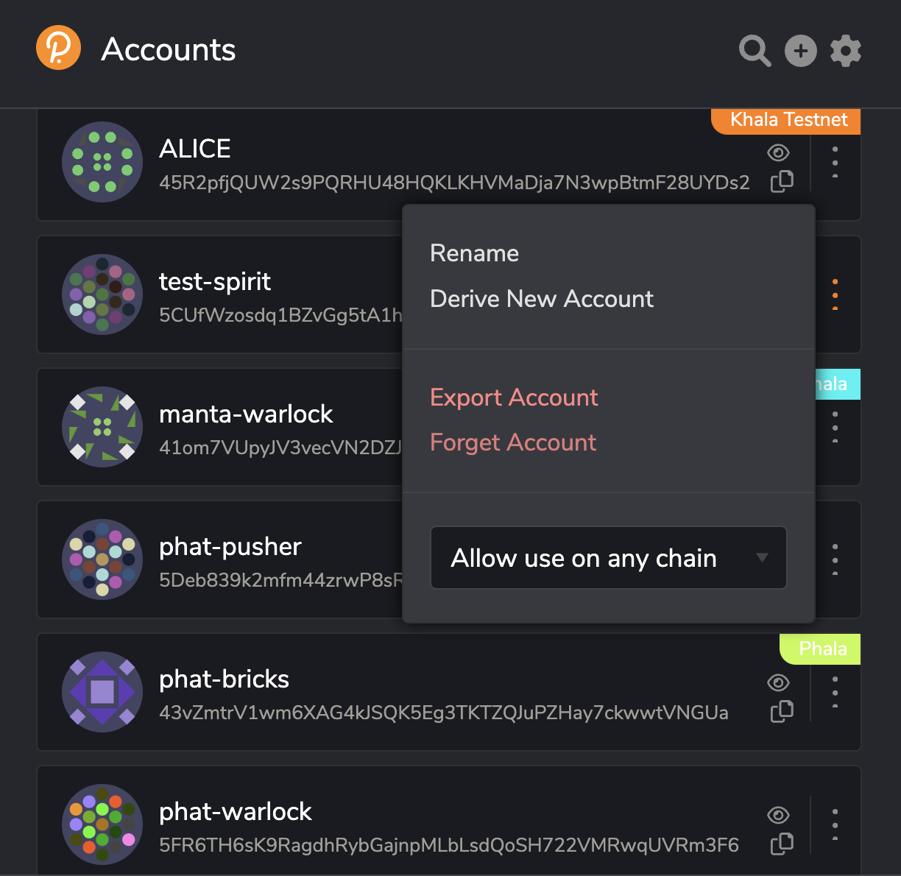
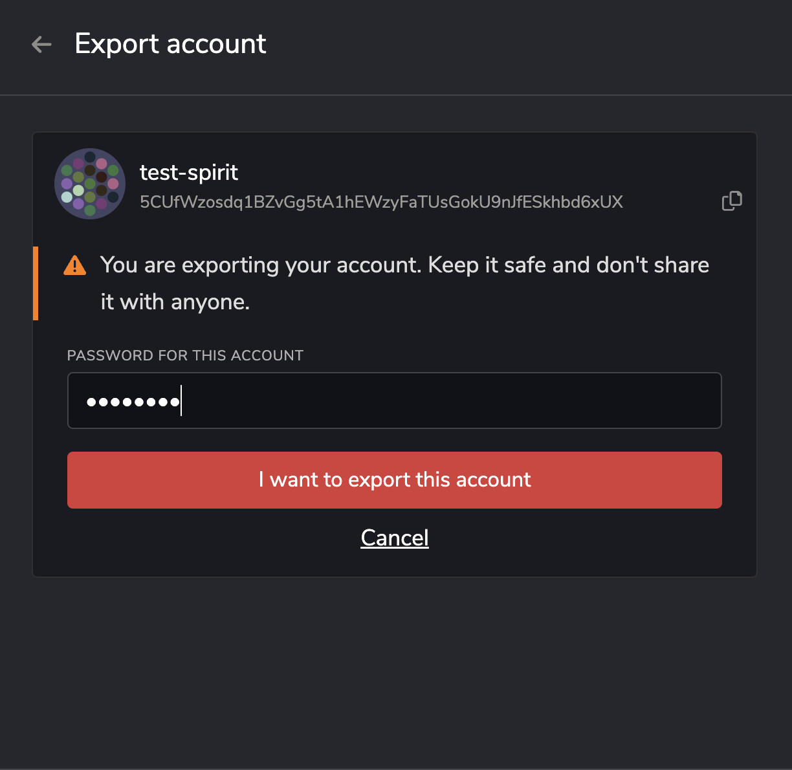
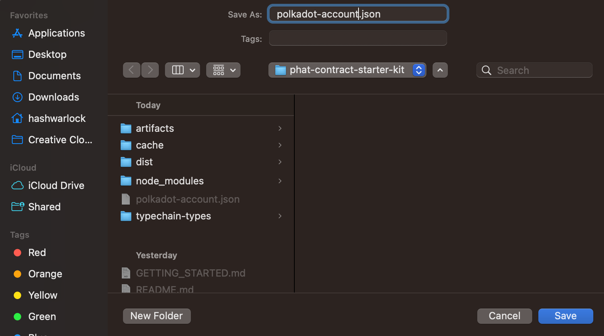

# Connect Phala's Oracle to EVM Consumer Contract


### Table of Contents
- [Overview](#overview)
- [Prerequisites](#prerequisites)
- [Getting Started](#getting-started)
  - [Environment Variables](#environment-variables)
- [Create a Phala Profile](#create-a-phala-profile)
- [Testing Locally](#testing-locally)
  - [Test Default Phat Contract Locally](#test-default-phat-contract-locally)
  - [Testing Default Phat Contract with Local Hardhat Node](#testing-default-phat-contract-with-local-hardhat-node)
- [Deployment](#deployment)
  - [Deploy to Polygon Mumbai Testnet](#deploy-to-polygon-mumbai-testnet)
    - [Verify Contract on Polygon Mumabai Testnet](#verify-contract-on-polygon-mumbai-testnet)
  - [Deploy Phat Contract to Phala PoC5 Testnet](#deploy-phat-contract-to-poc5-testnet)
    - [Interact with Consumer Contract on Polygon Mumbai](#interact-with-consumer-contract-on-polygon-mumbai)
    - [Update Phat Contract on Phala PoC5 Testnet](#update-phat-contract-on-phala-poc5-testnet)
  - [Deploy to Polygon Mainnet](#deploy-to-polygon-mainnet)
    - [Verify Contract on Polygon Mainnet](#verify-contract-on-polygon-mainnet)
  - [Deploy Phat Contract to Phala Mainnet](#deploy-phat-contract-to-phala-mainnet)
    - [Interact with Consumer Contract on Polygon Mainnet](#interact-with-consumer-contract-on-polygon-mainnet)
    - [Update Phat Contract on Phala Mainnet](#update-phat-contract-on-phala-mainnet)
      
- [Closing](#closing)

## Overview
This project represents a basic EVM Consumer Contract that is compatible with a deployed Oracle written in TypeScript on Phala Network.
> **Note**: For simplicity, we will utilize Polygon Mumbai and Polygon Mainnet for the following examples.

## Prerequisites
- Active Phala Profile with version `>= 1.0.1` via [Phat Contract 2.0 UI](https://bricks.phala.network)
- [Hardhat](https://hardhat.org)
- For EVM Mainnet deployments:
  - Ex: Polygonscan API Key that can be generated on [polygonscan](https://polygonscan.com)
- RPC Endpoint for EVM Chain Mainnet & EVM Chain Testnet
  - [Alchemy](https://alchemy.com) - This repo example uses Alchemy's API Key.
  - [Infura](https://infura.io)
  - Personal RPC Node (Ex. [ProjectPi](https://hub.projectpi.xyz/))
- Polkadot Account for Phala PoC5 Testnet and Mainnet deployment

### Environment Variables:
Check out the environment variables here in [.env.local](./.env.local) file.

## Getting Started
> :rotating_light: **Note** :rotating_light:: If you cloned this repo or created a template, skip to [Create a Phala Profile](#create-a-phala-profile)
> 
First you will need to install the `@phala/fn` CLI tool using your node package manager (`npm`) or use node package execute (`npx`). In this tutorial we use `npx`.

Now create your first template with the CLI tool command:
```bash
npx @phala/fn@latest init userJourney
# ? Please select one of the templates for your "userJourney" project: (Use arrow keys)
# ❯ phat-contract-starter-kit. The Phat Contract Starter Kit
#   lensapi-oracle-consumer-contract. Polygon Consumer Contract for LensAPI Oracle
```
Choose `phat-contract-starter-kit` template and press enter to see something similar to the example below:

```bash
npx @phala/fn@latest init userJourney
# ? Please select one of the templates for your "userJourney" project: phat-contract-starter-kit. The Phat Contract Starter Kit
# Downloading the template: https://github.com/Phala-Network/phat-contract-starter-kit... ✔
# The project is created in /Users/hashwarlock/Projects/Phala/Temp/userJourney 🎉
# Now run:
#
#  cd userJourney
#  npm install
```

`cd` into the newly created template and `ls` the directory which will look similar to below.

```bash
cd userJourney
ls
# total 736
# drwxr-xr-x  18 hashwarlock  staff   576B Sep  6 15:32 .
# drwxr-xr-x  35 hashwarlock  staff   1.1K Sep  6 15:32 ..
# -rw-r--r--   1 hashwarlock  staff   2.1K Sep  6 15:32 .env.local
# -rw-r--r--   1 hashwarlock  staff   227B Sep  6 15:32 .gitignore
# -rw-r--r--   1 hashwarlock  staff    34K Sep  6 15:32 LICENSE
# -rw-r--r--   1 hashwarlock  staff   8.9K Sep  6 15:32 README.md
# drwxr-xr-x   4 hashwarlock  staff   128B Sep  6 15:32 assets
# drwxr-xr-x   5 hashwarlock  staff   160B Sep  6 15:32 contracts
# -rw-r--r--   1 hashwarlock  staff   1.3K Sep  6 15:32 hardhat.config.ts
# -rw-r--r--   1 hashwarlock  staff    95B Sep  6 15:32 mumbai.arguments.ts
# -rw-r--r--   1 hashwarlock  staff   2.6K Sep  6 15:32 package.json
# -rw-r--r--   1 hashwarlock  staff    96B Sep  6 15:32 polygon.arguments.ts
# drwxr-xr-x   5 hashwarlock  staff   160B Sep  6 15:32 scripts
# drwxr-xr-x   3 hashwarlock  staff    96B Sep  6 15:32 src
# drwxr-xr-x   3 hashwarlock  staff    96B Sep  6 15:32 test
# -rw-r--r--   1 hashwarlock  staff   201B Sep  6 15:32 tsconfig.json
# -rw-r--r--   1 hashwarlock  staff   290K Sep  6 15:32 yarn.lock
```

## Create a Phala Profile
This step requires you to have a Polkadot account. You can get an account from one of the following:
- [Polkadot.js Wallet Extension](https://polkadot.js.org/extension/)
- [Talisman Wallet](https://www.talisman.xyz/)
- [SubWallet](https://www.subwallet.app/) (**Support for iOS/Android**)

First, create your Phala Profile account on the [Phala PoC5 Testnet](https://bricks-poc5.phala.network) or [Phala Mainnet](https://bricks.phala.network). Here is a quick 1 minute [YouTube video](https://youtu.be/z1MR48NYtYc) on setting up from scratch.
Here is what your Phala Profile account overview should look like:


#### Option 1: Export Polkadot account as json file
Go to your browser and click on the polkadot.js extension. Select your account and click "Export Account".

Next, you will be prompted for your password before saving the file to your project directory. **Note** this is what will be set to [`POLKADOT_WALLET_ACCOUNT_PASSWORD`](./.env.local).

Make sure to save the file as `polkadot-account.json` in the root of your project directory.


#### Option 2: Set mnemonic phrase to [`POLKADOT_WALLET_SURI`](./.env.local)
After creating your Phala Profile, set your `.env` variable [`POLKADOT_WALLET_SURI`](./.env.local) to the mnemonic phrase from generating the new Polkadot Account. 

Here is a screenshot of how to set `POLKADOT_WALLET_SURI`:


## Testing Locally

### Test Default Phat Contract Locally

With a template created and a basic default Phat Contract example ready to test, let’s step through the process of preparing your repo to execute the test locally.

First step is to install the package dependencies with the following command:
```bash
yarn install
```
Everything should go smoothly and produce similar output below:

```bash
yarn install
# [1/4] 🔍  Resolving packages...
# [2/4] 🚚  Fetching packages...
# [3/4] 🔗  Linking dependencies...
# warning " > @typechain/ethers-v5@10.1.0" has unmet peer dependency "@ethersproject/bytes@^5.0.0".
# [4/4] 🔨  Building fresh packages...
# ✨  Done in 4.95s.
```

Now that the package dependencies are installed, lets build the default Phat Contract which is located in [`./src/index.ts`](./src/index.ts).

For those want to understand what the contents of `./src/index.ts` mean, go to the `PHAT_CONTRACT_INFO.md` file to read more. If you are already familiar with the concepts then you can proceed to with the deployment process. 

Build the default Phat Contract with this command:
```bash
yarn build-function
```

You will see output similar to the example below. and a file in `./dist/index.js` will be generated.

```bash
yarn build-function
# Creating an optimized build... done
# Compiled successfully.
#
#   17.66 KB  dist/index.js
# ✨  Done in 3.48s.
```

With our default Phat Contract built, we can run some initial tests. First test will be simple.
```bash
yarn run-function
```
It was expected for it to fail like this:
```bash
yarn run-function
# handle req: undefined
# Malformed request received
# {"output":"0x000000000000000000000000000000000000000000000000000000000000000200000000000000000000000000000000000000000000000000000000000000000000000000000000000000000000000000000000000000000000000000000000"}
# ✨  Done in 0.96s.
```

Notice that the test fails and reports that a `Malformed request received` was emitted and the request was `undefined`. This is expected as you will need to define the parameters by adding a `-a abi.encode(requestId, profileId) https://api-mumbai.lens.dev` to your command.

To simulate the expected result locally, run the Phala Oracle function now with this command:
```bash
yarn run-function -a 0x0000000000000000000000000000000000000000000000000000000000000001000000000000000000000000000000000000000000000000000000000000004000000000000000000000000000000000000000000000000000000000000000043078303100000000000000000000000000000000000000000000000000000000 https://api-mumbai.lens.dev
```
>
> **What are the ingredients for the `yarn run-function` command?**
>
> Our Phat Contract script, now fully constructed, is ready for a trial run. This simulation mirrors the live script's operation when deployed on the Phala Network.
>
> The command's first parameter is a HexString, representing a tuple of types `[uintCoder, bytesCoder]`. This serves as the entry function. The second parameter is a `string`, embodying the configurable secrets fed into the main function.
>
> The `Coders.decode` function deciphers these parameters, yielding the decoded `requestId` and `encodedReqStr`. These decoded elements then become the raw material for the rest of the custom logic within the script.
> ```typescript 
> export default function main(request: HexString, secrets: string): HexString {
>   console.log(`handle req: ${request}`);
>   let requestId, encodedReqStr;
>   try {
>     [requestId, encodedReqStr] = Coders.decode([uintCoder, bytesCoder], request);
>   } catch (error) {
>     console.info("Malformed request received");
>   }
> // ...
> } 

<details>
  <summary><u>How the query looks under the hood</u></summary>

- HTTP Endpoint: https://api-mumbai.lens.dev
- Profile ID: `0x01`
- Expected Graphql Query:
  ```graphql
  query Profile {
    profile(request: { profileId: "0x01" }) {
      stats {
          totalFollowers
          totalFollowing
          totalPosts
          totalComments
          totalMirrors
          totalPublications
          totalCollects
      }
    }
  }
  ```
- Expected Output:
  ```json
  {
    "data": {
      "profile": {
        "stats": {
          "totalFollowers": 3361,
          "totalFollowing": 0,
          "totalPosts": 3,
          "totalComments": 0,
          "totalMirrors": 0,
          "totalPublications": 3,
          "totalCollects": 1597
        }
      }
    }
  }
  ```
</details>

You will see:
```bash
yarn run-function -a 0x00000000000000000000000000000000000000000000000000000000000000010000000000000000000000000000000000000000000000000000000000000040000000
00000000000000000000000000000000000000000000000000000000043078303100000000000000000000000000000000000000000000000000000000 https://api-mumbai.lens.dev
# handle req: 0x0000000000000000000000000000000000000000000000000000000000000001000000000000000000000000000000000000000000000000000000000000004000000000000000000000000000000000000000000000000000000000000000043078303100000000000000000000000000000000000000000000000000000000
# Request received for profile 0x01
# response: 0,1,3346
# {"output":"0x000000000000000000000000000000000000000000000000000000000000000000000000000000000000000000000000000000000000000000000000000000010000000000000000000000000000000000000000000000000000000000000d12"}
# ✨  Done in 1.42s.
```

We have now successfully tested the default Phat Contract and ran a test to verify the function returns a response as expected.

### Testing Default Phat Contract with Local Hardhat Node

Previously we showed how to test the default Phat Contract locally without a running node, but we can also run two other tests.

1. Run the default mocha e2e tests.
2. Run local hardhat node and watch the requests that are pushed and see how the Phat Contract transforms the data.

**Run the default mocha e2e tests**

Lets’s start with the first test case.

> Note: You will need to ensure you configure your local vars `POLYGON_RPC_URL` and `MUMBAI_RPC_URL` `.env` file. You can do this with `cp .env.local .env` then edit the `.env` with your information.


<details>
  <summary>Expected error if <code>.env</code> not configured.</summary>

    yarn hardhat test
    # Error HH8: There's one or more errors in your config file:
    
    #  * Invalid value undefined for HardhatConfig.networks.polygon.url - Expected a value of type string.
    #  * Invalid value undefined for HardhatConfig.networks.mumbai.url - Expected a value of type string.
      
    # To learn more about Hardhat's configuration, please go to https://hardhat.org/config/
    
    # For more info go to https://hardhat.org/HH8 or run Hardhat with --show-stack-traces
    # error Command failed with exit code 1.
    # info Visit https://yarnpkg.com/en/docs/cli/run for documentation about this command.
</details>

```bash
yarn hardhat test
```

You will now see that all test cases have passed.
```bash
yarn hardhat test
# Compiled 14 Solidity files successfully
#
#  OracleConsumerContract.sol
#    ✔ Push and receive message (1664ms)
#
#  1 passing (2s)
#
# ✨  Done in 3.29s.
```

This is how the e2e mocha test will look like. You can customize this file at [`OracleConsumerContract.ts`](./test/OracleConsumerContract.ts).


**Run local hardhat node and watch the requests that are pushed and see how the Phat Contract transforms the data**

First we will start a local hardhat node.

```bash
yarn hardhat node
```

<details>
  <summary>Example output</summary>

	yarn hardhat node
	# Started HTTP and WebSocket JSON-RPC server at http://127.0.0.1:8545/

	# Accounts
	# ========

	# WARNING: These accounts, and their private keys, are publicly known.
	# Any funds sent to them on Mainnet or any other live network WILL BE LOST.
</details>

With our hardhat node running locally, we can now deploy the `OracleConsumerContract.sol` contract to the local hardhat network.
```bash
yarn localhost-deploy 
```

```bash
yarn localhost-deploy
# Deploying...
# Deployed { consumer: '0x0165878A594ca255338adfa4d48449f69242Eb8F' }
# ✨  Done in 0.94s.
```

Make sure to copy the deployed contract address when you deploy your own contract locally. Note you contract address will be different than `0x0165878A594ca255338adfa4d48449f69242Eb8F`. We will now start watching the hardhat node deployed contract for any new requests.

```bash
yarn localhost-watch 0x0165878A594ca255338adfa4d48449f69242Eb8F artifacts/contracts/OracleConsumerContract.sol/OracleConsumerContract.json dist/index.js -a https://api-mumbai.lens.dev/
```

```bash
yarn localhost-watch 0x0165878A594ca255338adfa4d48449f69242Eb8F artifacts/contracts/OracleConsumerContract.sol/OracleConsumerContract.json dist/index.js -a https://api-mumbai.lens.dev/
# $ phat-fn watch 0x0165878A594ca255338adfa4d48449f69242Eb8F artifacts/contracts/OracleConsumerContract.sol/OracleConsumerContract.sol.json dist/index.js -a https://api-mumbai.lens.dev/
# Listening for OracleConsumerContract.sol MessageQueued events...
```

Let’s now make a new request and see what happens with the listener’s output. In separate tab, you will push a request with the following.

```bash
LOCALHOST_CONSUMER_CONTRACT_ADDRESS=0x0165878A594ca255338adfa4d48449f69242Eb8F yarn localhost-push-request
```

```bash
LOCALHOST_CONSUMER_CONTRACT_ADDRESS=0x0165878A594ca255338adfa4d48449f69242Eb8F yarn localhost-push-request
# Pushing a request...
# Received event [ResponseReceived]: {
#  reqId: BigNumber { value: "1" },
#  input: '0x01',
#  value: BigNumber { value: "1597" }
# }
# ✨  Done in 4.99s.
```

If we look back at the listener tab, we will see output has been appended.

```typescript
Listening for OracleConsumerContract MessageQueued events...
Received event [MessageQueued]: {
  tail: 0n,
  data: '0x0000000000000000000000000000000000000000000000000000000000000001000000000000000000000000000000000000000000000000000000000000004000000000000000000000000000000000000000000000000000000000000000043078303100000000000000000000000000000000000000000000000000000000'
}
handle req: 0x0000000000000000000000000000000000000000000000000000000000000001000000000000000000000000000000000000000000000000000000000000004000000000000000000000000000000000000000000000000000000000000000043078303100000000000000000000000000000000000000000000000000000000
Request received for profile 0x01
response: 0,1,1597
JS Execution output: 0x00000000000000000000000000000000000000000000000000000000000000000000000000000000000000000000000000000000000000000000000000000001000000000000000000000000000000000000000000000000000000000000063d
```

## Deployment
Now that you have the prerequisites to deploy a Polygon Consumer Contract on Polygon, lets begin with some initials tasks.
### Install Dependencies & Compile Contracts
```shell
# install dependencies
$ yarn

# compile contracts
$ yarn compile
```
### Deploy to Polygon Mumbai Testnet
With the contracts successfully compiled, now we can begin deploying first to Polygon Mumbai Testnet. If you have not gotten `MATIC` for Mumbai Testnet then get `MATIC` from a [faucet](https://mumbaifaucet.com/).
Ensure to save the address after deploying the Consumer Contract because this address will be use in the "[Configure Client](https://docs.phala.network/developers/bricks-and-blueprints/featured-blueprints/lensapi-oracle#step-4-configure-the-client-address)" section of Phat Bricks UI. The deployed address will also be set to the environment variable [`MUMBAI_CONSUMER_CONTRACT_ADDRESS`](./.env.local).
```bash
yarn test-deploy
```
```shell
# deploy contracts to testnet mumbai
yarn test-deploy
# Deploying...
#
# 🎉 Your Consumer Contract has been deployed, check it out here: https://mumbai.polygonscan.com/address/0x10FA409109E073C15b77A8352cB6A89C12CD1605
#
# You also need to set up the consumer contract address in your .env file:
#
# MUMBAI_CONSUMER_CONTRACT_ADDRESS=0x10FA409109E073C15b77A8352cB6A89C12CD1605
#
# Configuring...
# Done
# ✨  Done in 8.20s.
```
#### (Optional) Verify Contract on Polygon Mumbai Testnet
Ensure to update the [`mumbai.arguments.ts`](./mumbai.arguments.ts) file with the constructor arguments used to instantiate the Consumer Contract. If you add additional parameters to the constructor function then make sure to update the `mumbai.arguments.ts` file.
> **Note**: Your contract address will be different than `0x090E8fDC571d65459569BC87992C1026121DB955` when verifying your contract. Make sure to get your actual contract address from the console log output after executing `yarn test-deploy`.
```shell
yarn test-verify <MUMBAI_CONSUMER_CONTRACT_ADDRESS>
```
```shell
yarn test-verify 0x090E8fDC571d65459569BC87992C1026121DB955
# yarn run v1.22.18
# $ hardhat verify --network mumbai --constructor-args mumbai.arguments.ts 0x090E8fDC571d65459569BC87992C1026121DB955
# Nothing to compile
# No need to generate any newer typings.
# Successfully submitted source code for contract
# contracts/OracleConsumerContract.sol:OracleConsumerContract.sol at 0x090E8fDC571d65459569BC87992C1026121DB955
# for verification on the block explorer. Waiting for verification result...
#
# Successfully verified contract OracleConsumerContract.sol on Etherscan.
# https://mumbai.polygonscan.com/address/0x090E8fDC571d65459569BC87992C1026121DB955#code
# ✨  Done in 5.91s.
```

### Deploy Phat Contract to PoC5 Testnet
For customizing your Phat Contract, checkout Phat Contract custom configurations in [JS_API_DOC.md](./src/JS_API_DOC.md) to learn more before deploying to PoC5 testnet.

Now that are Phat Contract has built successfully, let's deploy to Phala PoC5 Testnet with the following command:
```shell
# If you did not export your Polkadot account in a 
# polkadot-account.json file in the root of project
yarn test-deploy-function
# If polkadot-account.json is in the root of project
yarn test-deploy-function -a ./polkadot-account.json
```
Here is the expected output:
> Note: your contract IDs will vary and not be the same as the IDs below.
```shell
yarn test-deploy-function -a ./polkadot-account.json
# ? Please enter your client RPC URL https://polygon-mumbai.g.alchemy.com/v2/JLjOfWJycWFOA0kK_SJ4jLGjtXkMN1wc
# ? Please enter your consumer address 0xA4Be456Fd0d41968a52b34Cdb8Ba875F2281134a
# ? Please Enter hahaha account password [hidden]
# Creating an optimized build... done
# Compiled successfully.
#
#  17.64 KB  dist/index.js
# Connecting to the endpoint: wss://poc5.phala.network/ws... ⡿
# (node:25497) ExperimentalWarning: buffer.Blob is an experimental feature. This feature could change at any time
# Connecting to the endpoint: wss://poc5.phala.network/ws... done
# Querying your Brick Profile contract ID... done
# Your Brick Profile contract ID: 0x4071788a8ce6fbab0cacea0cb1aa52853b5537db7955643e5010c22913c2b1dd
# Instantiating the ActionOffchainRollup contract... done
# The ActionOffchainRollup contract has been instantiated: 0x9c777c16b0a185caa895835b8f3b9e8d67be9f5e30197f71b4d32d2b8fde4b3b
# Setting up the actions... done
# 🎉 Your workflow has been added, you can check it out here: https://bricks-poc5.phala.network/workflows/0x4071788a8ce6fbab0cacea0cb1aa52853b5537db7955643e5010c22913c2b1dd/3
# Your Attestor address: 0x2b5fe2920cce2f522d69613adaa9378ba43b687d
# Your WORKFLOW_ID: 3
# ✨  Done in 73.22s.
```

Go to the [PoC5 Testnet Phat Contract UI](https://bricks-poc5.phala.network) Dashboard and you can see your newly deployed Phat Contract.


#### Interact with Consumer Contract on Polygon Mumbai
Test Consumer Contract on Mumbai with a few tests to check for malformed requests failures, successful requests, and set the attestor.

**Please make sure your have set your attestor address in .env file `MUMBAI_PHALA_ORACLE_ATTESTOR=`**
```shell
yarn test-set-attestor
```
```shell
yarn test-set-attestor
# yarn run v1.22.18
# $ hardhat run --network mumbai ./scripts/mumbai/set-attestor.ts
# Setting attestor...
# 🚨NOTE🚨
# Make sure to set the Consumer Contract Address in your Phat Contract 2.0 UI dashboard (https://bricks-poc5.phala.network)
# - Go to 'Configure Client' section where a text box reads 'Add Consumer Smart Contract'
# - Set value to 0x090E8fDC571d65459569BC87992C1026121DB955
# Done
# ✨  Done in 2.69s.
```

Test pushing a malform request.

```shell
yarn test-push-malformed-request
```
```shell
yarn test-push-malformed-request
# yarn run v1.22.18
# $ hardhat run --network mumbai ./scripts/mumbai/push-malformed-request.ts
# Pushing a malformed request...
# Done
# ✨  Done in 2.48s.
```

Test pushing a valid request.

```shell
yarn test-push-request
```
```shell
yarn test-push-request
# Pushing a request...
# Done
# ✨  Done in 2.97s.
```

### Update Phat Contract on Phala PoC5 Testnet
Sometimes you may have had a bug in your script or you want to test things out on the fly without deploying a whole new Phat Contract. We now allow you to update your Phat Contract easily in the commandline.
Now let's update the Phat Contract with the following command:
```shell
# If you did not export your Polkadot account in a 
# polkadot-account.json file in the root of project
yarn test-update-function
# If polkadot-account.json is in the root of project
yarn test-update-function -a ./polkadot-account.json
```
```shell
yarn test-update-function -a ./polkadot-account.json
# ? Please Enter hahaha account password [hidden]
# Creating an optimized build... done
# Compiled successfully.
#
#   17.64 KB  dist/index.js
# Connecting to the endpoint: wss://poc5.phala.network/ws... ⡿
# (node:25392) ExperimentalWarning: buffer.Blob is an experimental feature. This feature could change at any time
# Connecting to the endpoint: wss://poc5.phala.network/ws... done
# Querying your Brick Profile contract ID... done
# Your Brick Profile contract ID: 0x4071788a8ce6fbab0cacea0cb1aa52853b5537db7955643e5010c22913c2b1dd
# Checking your workflow settings... done
# Updating... done
# The Phat Function for workflow 1 has been updated.
# ✨  Done in 10.82s.
```
Congrats! You've now successfully updated your Phat Contract!

### Deploy to Polygon Mainnet
Ensure to save the address after deploying the Consumer Contract because this address will be used in the "[Configure Client](https://docs.phala.network/developers/bricks-and-blueprints/featured-blueprints/lensapi-oracle#step-4-configure-the-client-address)" section of Phat Bricks UI. The deployed address will also be set to the environment variable [`POLYGON_CONSUMER_CONTRACT_ADDRESS`](./.env.local).
> **Note**: Your contract address will be different than `0xbb0d733BDBe151dae3cEf8D7D63cBF74cCbf04C4` when verifying your contract. Make sure to get your actual contract address from the console log output after executing `yarn main-deploy`.
```shell
yarn main-deploy
# Deploying...
#
# 🎉 Your Consumer Contract has been deployed, check it out here: https://polygonscan.com/address/0xbb0d733BDBe151dae3cEf8D7D63cBF74cCbf04C4
#
# You also need to set up the consumer contract address in your .env file:
#
# POLYGON_CONSUMER_CONTRACT_ADDRESS=0xbb0d733BDBe151dae3cEf8D7D63cBF74cCbf04C4
#
# Configuring...
# Done
# ✨  Done in 8.20s.
```
#### (Optional) Verify Contract on Polygon Mainnet
Ensure to update the [`polygon.arguments.ts`](./polygon.arguments.ts) file with the constructor arguments used to instantiate the Consumer Contract. If you add additional parameters to the constructor function then make sure to update the `polygon.arguments.ts` file.
```shell
yarn main-verify 0xbb0d733BDBe151dae3cEf8D7D63cBF74cCbf04C4
# Nothing to compile
# No need to generate any newer typings.
# Successfully submitted source code for contract
# contracts/OracleConsumerContract.sol.sol:OracleConsumerContract.sol.sol.sol at 0xbb0d733BDBe151dae3cEf8D7D63cBF74cCbf04C4
# for verification on the block explorer. Waiting for verification result...
#
# Successfully verified contract OracleConsumerContract.sol on Etherscan.
# https://polygonscan.com/address/0xbb0d733BDBe151dae3cEf8D7D63cBF74cCbf04C4#code
# Done in 8.88s.
```
### Deploy Phat Contract to Phala Mainnet
For customizing your Phat Contract, Phat Contract custom configurations can be found here in [JS_API_DOC.md](./src/JS_API_DOC.md) to learn more before deploying to Phala Mainnet.

Now that are Phat Contract has built successfully, let's deploy to Phala Mainnet with the following command:
```shell
# If you did not export your Polkadot account in a 
# polkadot-account.json file in the root of project
yarn main-deploy-function
# If polkadot-account.json is in the root of project
yarn main-deploy-function -a ./polkadot-account.json
```
Here is the expected output:
> Note: your contract IDs will vary and not be the same as the IDs below.
```shell
yarn main-deploy-function -a ./polkadot-account.json
# ? Please enter your client RPC URL https://polygon.g.alchemy.com/v2/JLjOfWJycWFOA0kK_SJ4jLGjtXkMN1wc
# ? Please enter your consumer address 0xA4Be456Fd0d41968a52b34Cdb8Ba875F2281134a
# ? Please Enter hahaha account password [hidden]
# Creating an optimized build... done
# Compiled successfully.
#
#  17.64 KB  dist/index.js
# Connecting to the endpoint: wss://api.phala.network/ws... ⡿
# (node:25497) ExperimentalWarning: buffer.Blob is an experimental feature. This feature could change at any time
# Connecting to the endpoint: wss://api.phala.network/ws... done
# Querying your Brick Profile contract ID... done
# Your Brick Profile contract ID: 0x4071788a8ce6fbab0cacea0cb1aa52853b5537db7955643e5010c22913c2b1dd
# Instantiating the ActionOffchainRollup contract... done
# The ActionOffchainRollup contract has been instantiated: 0x9c777c16b0a185caa895835b8f3b9e8d67be9f5e30197f71b4d32d2b8fde4b3b
# Setting up the actions... done
# 🎉 Your workflow has been added, you can check it out here: https://bricks-poc5.phala.network/workflows/0x4071788a8ce6fbab0cacea0cb1aa52853b5537db7955643e5010c22913c2b1dd/3
# Your Attestor address: 0x2b5fe2920cce2f522d69613adaa9378ba43b687d
# Your WORKFLOW_ID: 2
# ✨  Done in 73.22s.
```

#### Interact with Consumer Contract on Polygon Mainnet
Execute Scripts to Consumer Contract on Polygon Mainnet. The Consumer Contract on Polygon Mainnet with a few actions to mimic a malformed request, successful requests, and set the attestor.
```shell
yarn main-set-attestor
# Setting attestor...
# 🚨NOTE🚨
# Make sure to set the Consumer Contract Address in your Phat Contract 2.0 UI dashboard (https://bricks-poc5.phala.network)
# - Go to 'Configure Client' section where a text box reads 'Add Consumer Smart Contract'
# - Set value to 0xbb0d733BDBe151dae3cEf8D7D63cBF74cCbf04C4
# Done
# ✨  Done in 1.56s.
# execute push-malformed-request
yarn main-push-malformed-request
# Pushing a malformed request...
# Done
# execute push-request
yarn main-push-request
# Pushing a request...
# Done
```

### Update Phat Contract on Phala Mainnet
Sometimes you may have had a bug in your script or you want to test things out on the fly without deploying a whole new Phat Contract. We now allow you to update your Phat Contract easily in the commandline.
Now let's update the Phat Contract with the following command:
```shell
# If you did not export your Polkadot account in a 
# polkadot-account.json file in the root of project
yarn main-update-function
# If polkadot-account.json is in the root of project
yarn main-update-function -a ./polkadot-account.json
```
```shell
yarn main-update-function -a ./polkadot-account.json
# ? Please Enter hahaha account password [hidden]
# Creating an optimized build... done
# Compiled successfully.
#
#   17.64 KB  dist/index.js
# Connecting to the endpoint: wss://api.phala.network/ws... ⡿
# (node:25392) ExperimentalWarning: buffer.Blob is an experimental feature. This feature could change at any time
# Connecting to the endpoint: wss://api.phala.network/ws... done
# Querying your Brick Profile contract ID... done
# Your Brick Profile contract ID: 0x4071788a8ce6fbab0cacea0cb1aa52853b5537db7955643e5010c22913c2b1dd
# Checking your workflow settings... done
# Updating... done
# The Phat Function for workflow 1 has been updated.
# ✨  Done in 10.82s.
```

## Closing
Once you have stored, the deployed address of the Consumer Contract and set the value in the "Configure Client" section of the deployed Phala Oracle, you will now have a basic boilerplate example of how to connect your Polygon dApp to a Phala Oracle Template. Execute a new requests and check if your configuration is correct like below:

