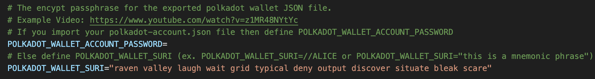
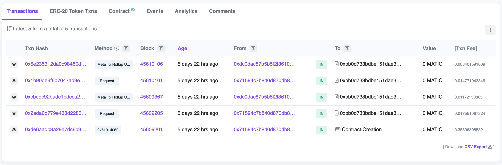

# Polygon Consumer Contract for LensAPI Oracle

- [Overview](#overview)
- [Prerequisites](#prerequisites)
- [Getting Started](#getting-started)
  - [Environment Variables](#environment-variables)
- [Create a Bricks Profile](#create-a-bricks-profile)
- [Testing Locally](#testing-locally)
  - [Test Default Function Locally](#test-default-function-locally)
  - [Testing Default Function with Local Hardhat Node](#testing-default-function-with-local-hardhat-node)
- [Deployment](#deployment)
  - [Deploy to Polygon Mumbai Testnet](#deploy-to-polygon-mumbai-testnet)
    - [Verify Contract on Polygon Mumabai Testnet](#verify-contract-on-polygon-mumbai-testnet)
  - [Deploy Phat Contract to Phala PoC5 Testnet](#deploy-phat-contract-to-poc5-testnet)
    - [Interact with Consumer Contract on Polygon Mumbai](#interact-with-consumer-contract-on-polygon-mumbai)
    - [Update Phat Contract on Phala PoC5 Testnet](#update-phat-contract-on-phala-poc5-testnet)
  - [Deploy to Polygon Mainnet](#deploy-to-polygon-mainnet)
    - [Verify Contract on Polygon Mainnet](#verify-contract-on-polygon-mainnet)
  - [Deploy Phat Contract to Phala Mainnet](#deploy-phat-contract-to-phala-mainnet)
    - [Interact with Consumer Contract on Polygon Mainnet](#interact-with-consumer-contract-on-polygon-mainnet)
    - [Update Phat Contract on Phala Mainnet](#update-phat-contract-on-phala-mainnet)
      
- [Closing](#closing)

## Overview
This project represents a basic Polygon Consumer Contract that is compatible with a deployed LensAPI Oracle via [Phat Bricks UI](https://bricks.phala.network).

## Prerequisites
- Active Bricks Profile with version `1.0.1` via [Phat Bricks](https://bricks.phala.network)
- [Hardhat](https://hardhat.org)
- For EVM Mainnet deployments:
  - Ex: Polygonscan API Key that can be generated on [polygonscan](https://polygonscan.com)
- RPC Endpoint for EVM Chain Mainnet & EVM Chain Testnet
  - [Alchemy](https://alchemy.com) - This repo example uses Alchemy's API Key.
  - [Infura](https://infura.io)
  - Personal RPC Node
- Polkadot Account for Phala PoC5 Testnet and Mainnet deployment

### Environment Variables:
Check out the environment variables here in [.env.local](./.env.local) file.

## Getting Started
> Note: If you cloned this repo or created a template, skip to [Create a Bricks Profile](#create-a-bricks-profile)
> 
First you will need to install the [@phala/fn](https://www.npmjs.com/package/@phala/fn) CLI tool using your node package manager (`npm`) or use node package execute (`npx`). In this tutorial we use `npx`.

Now create your first template with the CLI tool command:
```bash
npx @phala/fn init example
```
We currently have only one template. Just press enter to see something similar to the example below:

```bash
npx @phala/fn init example
# ? Please select one of the templates for your "example" project: lensapi-oracle-consumer-contract. Polygon Consumer Contract for LensAPI Oracle
# Downloading the template: https://github.com/Phala-Network/lensapi-oracle-consumer-contract... ✔
# The project is created in ~/Projects/Phala/example
```

`cd` into the newly created template and `ls` the directory which will look similar to below.

```bash
cd example
ls
# total 736
# drwxr-xr-x  18 hashwarlock  staff   576B Sep  6 15:32 .
# drwxr-xr-x  35 hashwarlock  staff   1.1K Sep  6 15:32 ..
# -rw-r--r--   1 hashwarlock  staff   2.1K Sep  6 15:32 .env.local
# -rw-r--r--   1 hashwarlock  staff   227B Sep  6 15:32 .gitignore
# -rw-r--r--   1 hashwarlock  staff    34K Sep  6 15:32 LICENSE
# -rw-r--r--   1 hashwarlock  staff   8.9K Sep  6 15:32 README.md
# drwxr-xr-x   5 hashwarlock  staff   160B Sep  6 15:32 abis
# drwxr-xr-x   4 hashwarlock  staff   128B Sep  6 15:32 assets
# drwxr-xr-x   5 hashwarlock  staff   160B Sep  6 15:32 contracts
# -rw-r--r--   1 hashwarlock  staff   1.3K Sep  6 15:32 hardhat.config.ts
# -rw-r--r--   1 hashwarlock  staff    95B Sep  6 15:32 mumbai.arguments.ts
# -rw-r--r--   1 hashwarlock  staff   2.6K Sep  6 15:32 package.json
# -rw-r--r--   1 hashwarlock  staff    96B Sep  6 15:32 polygon.arguments.ts
# drwxr-xr-x   5 hashwarlock  staff   160B Sep  6 15:32 scripts
# drwxr-xr-x   3 hashwarlock  staff    96B Sep  6 15:32 src
# drwxr-xr-x   3 hashwarlock  staff    96B Sep  6 15:32 test
# -rw-r--r--   1 hashwarlock  staff   201B Sep  6 15:32 tsconfig.json
# -rw-r--r--   1 hashwarlock  staff   290K Sep  6 15:32 yarn.lock
```

## Create a Bricks Profile
This step requires you to have a Polkadot account. You can get an account from one of the following:
- [Polkadot.js Wallet Extension](https://polkadot.js.org/extension/)
- [Talisman Wallet](https://www.talisman.xyz/)
- [SubWallet](https://www.subwallet.app/) (**Support for iOS/Android**)

First, create your Bricks Profile account on the [Phala PoC5 Testnet](https://bricks-poc5.phala.network) or [Phala Mainnet](https://bricks.phala.network). Here is a quick 1 minute [YouTube video](https://youtu.be/z1MR48NYtYc) on setting up from scratch.

Here is what your Bricks Profile account overview should look like:


After creating your Bricks Profile, set your `.env` variable `POLKADOT_WALLET_SURI` to the mnemonic phrase from generating the new Polkadot Account. 

Here is a screenshot of how to set `POLKADOT_WALLET_SURI`:


## Testing Locally

### Test Default Function Locally

With a template created and a basic default function example ready to test, let’s step through the process of preparing your repo to execute the test locally.

First step is to install the package dependencies with the following command:
```bash
yarn install
```
Everything should go smoothly and produce similar output below:

```bash
yarn install
# [1/4] 🔍  Resolving packages...
# [2/4] 🚚  Fetching packages...
# [3/4] 🔗  Linking dependencies...
# warning " > @typechain/ethers-v5@10.1.0" has unmet peer dependency "@ethersproject/bytes@^5.0.0".
# [4/4] 🔨  Building fresh packages...
# ✨  Done in 4.95s.
```

Now that the package dependencies are installed, lets build the default function which is located in `./src/index.ts`.
<details>
  <summary> View file <code>./src/index.ts</code></summary>
    import "@phala/pink-env";
    import { Coders } from "@phala/ethers";

    type HexString = `0x${string}`
    
    // eth abi coder
    const uintCoder = new Coders.NumberCoder(32, false, "uint256");
    const bytesCoder = new Coders.BytesCoder("bytes");
    
    function encodeReply(reply: [number, number, number]): HexString {
      return Coders.encode([uintCoder, uintCoder, uintCoder], reply) as HexString;
    }
    
    // Defined in TestLensOracle.sol
    const TYPE_RESPONSE = 0;
    const TYPE_ERROR = 2;
    
    enum Error {
      BadLensProfileId = "BadLensProfileId",
      FailedToFetchData = "FailedToFetchData",
      FailedToDecode = "FailedToDecode",
      MalformedRequest = "MalformedRequest",
    }
    
    function errorToCode(error: Error): number {
      switch (error) {
        case Error.BadLensProfileId:
          return 1;
        case Error.FailedToFetchData:
          return 2;
        case Error.FailedToDecode:
          return 3;
        case Error.MalformedRequest:
          return 4;
        default:
          return 0;
      }
    }
    
    function isHexString(str: string): boolean {
      const regex = /^0x[0-9a-f]+$/;
      return regex.test(str.toLowerCase());
    }
    
    function stringToHex(str: string): string {
      var hex = "";
      for (var i = 0; i < str.length; i++) {
        hex += str.charCodeAt(i).toString(16);
      }
      return "0x" + hex;
    }
    
    function fetchLensApiStats(lensApi: string, profileId: string): any {
      // profile_id should be like 0x0001
      let headers = {
        "Content-Type": "application/json",
        "User-Agent": "phat-contract",
      };
      let query = JSON.stringify({
        query: `query Profile {
                profile(request: { profileId: \"${profileId}\" }) {
                    stats {
                        totalFollowers
                        totalFollowing
                        totalPosts
                        totalComments
                        totalMirrors
                        totalPublications
                        totalCollects
                    }
                }
            }`,
      });
      let body = stringToHex(query);
      //
      // In Phat Function runtime, we not support async/await, you need use `pink.batchHttpRequest` to
      // send http request. The function will return an array of response.
      //
      let response = pink.batchHttpRequest(
        [
          {
            url: lensApi,
            method: "POST",
            headers,
            body,
            returnTextBody: true,
          },
        ],
        2000
      )[0];
      if (response.statusCode !== 200) {
        console.log(
          `Fail to read Lens api with status code: ${response.statusCode}, error: ${
            response.error || response.body
          }}`
        );
        throw Error.FailedToFetchData;
      }
      let respBody = response.body;
      if (typeof respBody !== "string") {
        throw Error.FailedToDecode;
      }
      return JSON.parse(respBody);
    }
    
    function parseProfileId(hexx: string): string {
      var hex = hexx.toString();
      if (!isHexString(hex)) {
        throw Error.BadLensProfileId;
      }
      hex = hex.slice(2);
      var str = "";
      for (var i = 0; i < hex.length; i += 2) {
        const ch = String.fromCharCode(parseInt(hex.substring(i, i + 2), 16));
        str += ch;
      }
      return str;
    }
    
    //
    // Here is what you need to implemented for Phat Function, you can customize your logic with
    // JavaScript here.
    //
    // The function will be called with two parameters:
    //
    // - request: The raw payload from the contract call `request` (check the `request` function in TestLensApiConsumerConract.sol).
    //            In this example, it's a tuple of two elements: [requestId, profileId]
    // - settings: The custom settings you set with the `config_core` function of the Action Offchain Rollup Phat Contract. In
    //            this example, it just a simple text of the lens api url prefix.
    //
    // Your returns value MUST be a hex string, and it will send to your contract directly. Check the `_onMessageReceived` function in
    // TestLensApiConsumerContract.sol for more details. We suggest a tuple of three elements: [successOrNotFlag, requestId, data] as
    // the return value.
    //
    export default function main(request: HexString, settings: string): HexString {
      console.log(`handle req: ${request}`);
      let requestId, encodedProfileId;
      try {
        [requestId, encodedProfileId] = Coders.decode([uintCoder, bytesCoder], request);
      } catch (error) {
        console.info("Malformed request received");
        return encodeReply([TYPE_ERROR, 0, errorToCode(error as Error)]);
      }
      const profileId = parseProfileId(encodedProfileId as string);
      console.log(`Request received for profile ${profileId}`);
    
      try {
        const respData = fetchLensApiStats(settings, profileId);
        let stats = respData.data.profile.stats.totalCollects;
        console.log("response:", [TYPE_RESPONSE, requestId, stats]);
        return encodeReply([TYPE_RESPONSE, requestId, stats]);
      } catch (error) {
        if (error === Error.FailedToFetchData) {
          throw error;
        } else {
          // otherwise tell client we cannot process it
          console.log("error:", [TYPE_ERROR, requestId, error]);
          return encodeReply([TYPE_ERROR, requestId, errorToCode(error as Error)]);
        }
      }
    }
</details>  

Build the default function with this command:
```bash
yarn build-function
```

You will see output similar to the example below. and a file in `./dist/index.js` will be generated.

```bash
yarn build-function
# Creating an optimized build... done
# Compiled successfully.
#
#   17.66 KB  dist/index.js
# ✨  Done in 3.48s.
```

With our default function built, we can run some initial tests. First test will be simple.
```bash
yarn run-function
```
It was expected for it to fail like this:
```bash
yarn run-function
# handle req: undefined
# Malformed request received
# {"output":"0x000000000000000000000000000000000000000000000000000000000000000200000000000000000000000000000000000000000000000000000000000000000000000000000000000000000000000000000000000000000000000000000000"}
# ✨  Done in 0.96s.
```

Notice that the test fails and reports that a `Malformed request received` was emitted and the request was `undefined`. This is expected as you will need to define the parameters by adding a `-a abi.encode(requestId, profileId) https://api-mumbai.lens.dev` to your command.

Let’s try again.

> Note: You will need to use `abi.encode` the tuple of `(requestId, profileId)` to get the appropriate hexstring for the first argument.

```bash
yarn run-function -a 0x0000000000000000000000000000000000000000000000000000000000000001000000000000000000000000000000000000000000000000000000000000004000000000000000000000000000000000000000000000000000000000000000043078303100000000000000000000000000000000000000000000000000000000 https://api-mumbai.lens.dev
```
You will see:
```bash
yarn run-function -a 0x00000000000000000000000000000000000000000000000000000000000000010000000000000000000000000000000000000000000000000000000000000040000000
00000000000000000000000000000000000000000000000000000000043078303100000000000000000000000000000000000000000000000000000000 https://api-mumbai.lens.dev
# handle req: 0x0000000000000000000000000000000000000000000000000000000000000001000000000000000000000000000000000000000000000000000000000000004000000000000000000000000000000000000000000000000000000000000000043078303100000000000000000000000000000000000000000000000000000000
# Request received for profile 0x01
# response: 0,1,3346
# {"output":"0x000000000000000000000000000000000000000000000000000000000000000000000000000000000000000000000000000000000000000000000000000000010000000000000000000000000000000000000000000000000000000000000d12"}
# ✨  Done in 1.42s.
```

We have now successfully tested the default function and ran a test to verify the function returns a response as expected.

### Testing Default Function with Local Hardhat Node

Previously we showed how to test the default function locally without a running node, but we can also run two other tests.

1. Run the default mocha e2e tests.
2. Run local hardhat node and watch the requests that are pushed and see how the function transforms the data.

**Run the default mocha e2e tests**

Lets’s start with the first test case.

> Note: You will need to ensure you configure your local vars `POLYGON_RPC_URL` and `MUMBAI_RPC_URL` `.env` file. You can do this with `cp .env.local .env` then edit the `.env` with your information.


<details>
  <summary>Expected error if <code>.env</code> not configured.</summary>

    yarn hardhat test
    # Error HH8: There's one or more errors in your config file:
    
    #  * Invalid value undefined for HardhatConfig.networks.polygon.url - Expected a value of type string.
    #  * Invalid value undefined for HardhatConfig.networks.mumbai.url - Expected a value of type string.
      
    # To learn more about Hardhat's configuration, please go to https://hardhat.org/config/
    
    # For more info go to https://hardhat.org/HH8 or run Hardhat with --show-stack-traces
    # error Command failed with exit code 1.
    # info Visit https://yarnpkg.com/en/docs/cli/run for documentation about this command.
</details>

```bash
yarn hardhat test
```

You will now see that all test cases have passed.
```bash
yarn hardhat test
# Compiled 14 Solidity files successfully
#
#  TestLensApiConsumerContract
#    ✔ Push and receive message (1664ms)
#
#  1 passing (2s)
#
# ✨  Done in 3.29s.
```

This is how the e2e mocha test will look like. You can customize this file at `./test/TestLensApiConsumerContract.ts`.
<details>
  <summary>View file <code>TestLensApiConsumerContract.ts</code></summary>

    import { expect } from "chai";
    import { type Contract, type Event } from "ethers";
    import { ethers } from "hardhat";
    import { execSync } from "child_process";
    
    async function waitForResponse(consumer: Contract, event: Event) {
      const [, data] = event.args!;
      // Run Phat Function
      const result = execSync(`phat-fn run --json dist/index.js -a ${data} https://api-mumbai.lens.dev/`).toString();
      const json = JSON.parse(result);
      const action = ethers.utils.hexlify(ethers.utils.concat([
        new Uint8Array([0]),
        json.output,
      ]));
      // Make a response
      const tx = await consumer.rollupU256CondEq(
        // cond
        [],
        [],
        // updates
        [],
        [],
        // actions
        [action],
      );
      const receipt = await tx.wait();
      return receipt.events;
    }
    
    describe("TestLensApiConsumerContract", function () {
      it("Push and receive message", async function () {
        // Deploy the contract
        const [deployer] = await ethers.getSigners();
        const TestLensApiConsumerContract = await ethers.getContractFactory("TestLensApiConsumerContract");
        const consumer = await TestLensApiConsumerContract.deploy(deployer.address);
    
        // Make a request
        const profileId = "0x01";
        const tx = await consumer.request(profileId);
        const receipt = await tx.wait();
        const reqEvents = receipt.events;
        expect(reqEvents![0]).to.have.property("event", "MessageQueued");
    
        // Wait for Phat Function response
        const respEvents = await waitForResponse(consumer, reqEvents![0])
    
        // Check response data
        expect(respEvents[0]).to.have.property("event", "ResponseReceived");
        const [reqId, input, value] = respEvents[0].args;
        expect(ethers.BigNumber.isBigNumber(reqId)).to.be.true;
        expect(input).to.equal(profileId);
        expect(ethers.BigNumber.isBigNumber(value)).to.be.true;
      });
    });
</details>


**Run local hardhat node and watch the requests that are pushed and see how the function transforms the data**

First we will start a local hardhat node.

```bash
yarn hardhat node
```

<details>
  <summary>Example output</summary>

	yarn hardhat node
	# Started HTTP and WebSocket JSON-RPC server at http://127.0.0.1:8545/

	# Accounts
	# ========

	# WARNING: These accounts, and their private keys, are publicly known.
	# Any funds sent to them on Mainnet or any other live network WILL BE LOST.
</details>

With our hardhat node running locally, we can now deploy the `LensApiConsumerContract.sol` contract to the local hardhat network.
```bash
yarn localhost-deploy 
```

```bash
yarn localhost-deploy
# Deploying...
# Deployed { consumer: '0x0165878A594ca255338adfa4d48449f69242Eb8F' }
# ✨  Done in 0.94s.
```

Make sure to copy the deployed contract address when you deploy your own contract locally. Note you contract address will be different than `0x0165878A594ca255338adfa4d48449f69242Eb8F`. We will now start watching the hardhat node deployed contract for any new requests.

```bash
yarn localhost-watch 0x0165878A594ca255338adfa4d48449f69242Eb8F artifacts/contracts/TestLensApiConsumerContract.sol/TestLensApiConsumerContract.json dist/index.js -a https://api-mumbai.lens.dev/
```

```bash
yarn localhost-watch 0x0165878A594ca255338adfa4d48449f69242Eb8F artifacts/contracts/TestLensApiConsumerContract.sol/TestLensApiConsumerContract.json dist/index.js -a https://api-mumbai.lens.dev/
# $ phat-fn watch 0x0165878A594ca255338adfa4d48449f69242Eb8F artifacts/contracts/TestLensApiConsumerContract.sol/TestLensApiConsumerContract.json dist/index.js -a https://api-mumbai.lens.dev/
# Listening for TestLensApiConsumerContract MessageQueued events...
```

Let’s now make a new request and see what happens with the listener’s output. In separate tab, you will push a request with the following.

```bash
LOCALHOST_CONSUMER_CONTRACT_ADDRESS=0x0165878A594ca255338adfa4d48449f69242Eb8F yarn localhost-push-request
```

```bash
LOCALHOST_CONSUMER_CONTRACT_ADDRESS=0x0165878A594ca255338adfa4d48449f69242Eb8F yarn localhost-push-request
# Pushing a request...
# Received event [ResponseReceived]: {
#  reqId: BigNumber { value: "1" },
#  input: '0x01',
#  value: BigNumber { value: "1597" }
# }
# ✨  Done in 4.99s.
```

If we look back at the listener tab, we will see output has been appended.

```typescript
Listening for TestLensApiConsumerContract MessageQueued events...
Received event [MessageQueued]: {
  tail: 0n,
  data: '0x0000000000000000000000000000000000000000000000000000000000000001000000000000000000000000000000000000000000000000000000000000004000000000000000000000000000000000000000000000000000000000000000043078303100000000000000000000000000000000000000000000000000000000'
}
handle req: 0x0000000000000000000000000000000000000000000000000000000000000001000000000000000000000000000000000000000000000000000000000000004000000000000000000000000000000000000000000000000000000000000000043078303100000000000000000000000000000000000000000000000000000000
Request received for profile 0x01
response: 0,1,1597
JS Execution output: 0x00000000000000000000000000000000000000000000000000000000000000000000000000000000000000000000000000000000000000000000000000000001000000000000000000000000000000000000000000000000000000000000063d
```

## Deployment
Now that you have the prerequisites to deploy a Polygon Consumer Contract on Polygon, lets begin with some initials tasks.
### Install Dependencies & Compile Contracts
```shell
# install dependencies
$ yarn

# compile contracts
$ yarn compile
```
### Deploy to Polygon Mumbai Testnet
With the contracts successfully compiled, now we can begin deploying first to Polygon Mumbai Testnet. If you have not gotten `MATIC` for Mumbai Testnet then get `MATIC` from a [faucet](https://mumbaifaucet.com/).
Ensure to save the address after deploying the Consumer Contract because this address will be use in the "[Configure Client](https://docs.phala.network/developers/bricks-and-blueprints/featured-blueprints/lensapi-oracle#step-4-configure-the-client-address)" section of Phat Bricks UI. The deployed address will also be set to the environment variable [`MUMBAI_CONSUMER_CONTRACT_ADDRESS`](./.env.local).
```bash
yarn test-deploy
```
```shell
# deploy contracts to testnet mumbai
yarn test-deploy
# Deploying...
#
# 🎉 Your Consumer Contract has been deployed, check it out here: https://mumbai.polygonscan.com/address/0x10FA409109E073C15b77A8352cB6A89C12CD1605
#
# You also need to set up the consumer contract address in your .env file:
#
# MUMBAI_CONSUMER_CONTRACT_ADDRESS=0x10FA409109E073C15b77A8352cB6A89C12CD1605
#
# Configuring...
# Done
# ✨  Done in 8.20s.
```
#### Verify Contract on Polygon Mumbai Testnet
Ensure to update the [`mumbai.arguments.ts`](./mumbai.arguments.ts) file with the constructor arguments used to instantiate the Consumer Contract. If you add additional parameters to the constructor function then make sure to update the `mumbai.arguments.ts` file.
> **Note**: Your contract address will be different than `0x090E8fDC571d65459569BC87992C1026121DB955` when verifying your contract. Make sure to get your actual contract address from the console log output after executing `yarn test-deploy`.
```shell
yarn test-verify <MUMBAI_CONSUMER_CONTRACT_ADDRESS>
```
```shell
yarn test-verify 0x090E8fDC571d65459569BC87992C1026121DB955
# yarn run v1.22.18
# $ hardhat verify --network mumbai --constructor-args mumbai.arguments.ts 0x090E8fDC571d65459569BC87992C1026121DB955
# Nothing to compile
# No need to generate any newer typings.
# Successfully submitted source code for contract
# contracts/TestLensApiConsumerContract.sol:TestLensApiConsumerContract at 0x090E8fDC571d65459569BC87992C1026121DB955
# for verification on the block explorer. Waiting for verification result...
#
# Successfully verified contract TestLensApiConsumerContract on Etherscan.
# https://mumbai.polygonscan.com/address/0x090E8fDC571d65459569BC87992C1026121DB955#code
# ✨  Done in 5.91s.
```

### Deploy Phat Contract to PoC5 Testnet
For customizing your Phat Contract function, checkout default function [README.md](./src/README.md) and advanced configurations in [ADVANCED.md](./src/ADVANCED.md) to learn more before deploying to PoC5 testnet.

First you will need to build your function with this command:
```shell
yarn build-function
```
Here is the expected output:
```shell
yarn build-function
# yarn run v1.22.18
# $ phat-fn build src/index.ts
# Creating an optimized build... done
# Compiled successfully.
#
#   17.66 KB  dist/index.js
# ✨  Done in 3.71s.
```
Now that are Phat Contract function has built successfully, let's deploy to Phala PoC5 Testnet with the following command:
```shell
yarn test-deploy-function
```
Here is the expected output:
> Note: your contract IDs will vary and not be the same as the IDs below.
```shell
yarn test-deploy-function
# yarn run v1.22.18
# $ hardhat run --network mumbai ./scripts/mumbai/deploy-function.ts
# We going to deploy your Phat Function to Phala Network Testnet: wss://poc5.phala.network/ws
# (node:12200) ExperimentalWarning: buffer.Blob is an experimental feature. This feature could change at any time
# (Use `node --trace-warnings ...` to show where the warning was created)
# Your Brick Profile contract ID: 0xfd18dca07dc76811dd99b14ee6fe3b82e135ed06a2c311b741e6c9163892b32c
# The ActionOffchainRollup contract has been instantiated:  0x1161a649467fac4532b3ef85b70bf750380dea49c3efbb4ce8db66d0de47389a
#
# 🎉 Your workflow has been added, you can check it out here: https://bricks-poc5.phala.network//workflows/0xfd18dca07dc76811dd99b14ee6fe3b82e135ed06a2c311b741e6c9163892b32c/0
#
#   You also need set up the attestor to your .env file:
#
#   MUMBAI_LENSAPI_ORACLE_ENDPOINT=0x1f6911eaa71405eb043961c0ba4bb6ed7ecc5c8e
#
#   Then run:
#
#   yarn test-set-attestor
#
#   Then send the test request with follow up command:
#
#   yarn test-push-request
#
#   You can continue update the Phat Function codes and update it with follow up commands:
#
#   yarn build-function
#   WORKFLOW_ID=0 yarn test-update-function
#
# ✨  Done in 36.35s.
```

Go to the [PoC5 Testnet Bricks UI](https://bricks-poc5.phala.network) Dashboard and you can see your newly deployed function.


#### Interact with Consumer Contract on Polygon Mumbai
Test Consumer Contract on Mumbai with a few tests to check for malformed requests failures, successful requests, and set the attestor.
```shell
yarn test-set-attestor
```
```shell
yarn test-set-attestor
# yarn run v1.22.18
# $ hardhat run --network mumbai ./scripts/mumbai/set-attestor.ts
# Setting attestor...
# 🚨NOTE🚨
# Make sure to set the Consumer Contract Address in your Phat Bricks 🧱 UI dashboard (https://bricks-poc5.phala.network)
# - Go to 'Configure Client' section where a text box reads 'Add Consumer Smart Contract'
# - Set value to 0x090E8fDC571d65459569BC87992C1026121DB955
# Done
# ✨  Done in 2.69s.
```

Test pushing a malform request.

```shell
yarn test-push-malformed-request
```
```shell
yarn test-push-malformed-request
# yarn run v1.22.18
# $ hardhat run --network mumbai ./scripts/mumbai/push-malformed-request.ts
# Pushing a malformed request...
# Done
# ✨  Done in 2.48s.
```

Test pushing a valid request.

```shell
yarn test-push-request
```
```shell
yarn test-push-request
# Pushing a request...
# Done
# ✨  Done in 2.97s.
```

### Update Phat Contract on Phala PoC5 Testnet
Now let's update the function that we have deployed. Once we have updated the function, we must build the function again.
```shell
yarn build-function
```
```shell
yarn build-function
# yarn run v1.22.18
# $ phat-fn build src/index.ts
# Creating an optimized build... done
# Compiled successfully.
#
#  17.66 KB  dist/index.js
# ✨  Done in 3.48s.
```
> Note: Before we update the function, make sure to take the `WORKFLOW_ID` from the deployment of the Phat Contract function step and set it in your `.env` file.

Now let's update the function with the following command:
```shell
yarn test-update-function
```
```shell
yarn test-update-function
# yarn run v1.22.18
# $ hardhat run --network mumbai ./scripts/mumbai/update-function.ts
# (node:12991) ExperimentalWarning: buffer.Blob is an experimental feature. This feature could change at any time
# (Use `node --trace-warnings ...` to show where the warning was created)
# Your Brick Profile contract ID: 0xfd18dca07dc76811dd99b14ee6fe3b82e135ed06a2c311b741e6c9163892b32c
# The Phat Function for workflow 0 has been updated.
# ✨  Done in 5.07s.
```

### Deploy to Polygon Mainnet
Ensure to save the address after deploying the Consumer Contract because this address will be used in the "[Configure Client](https://docs.phala.network/developers/bricks-and-blueprints/featured-blueprints/lensapi-oracle#step-4-configure-the-client-address)" section of Phat Bricks UI. The deployed address will also be set to the environment variable [`POLYGON_CONSUMER_CONTRACT_ADDRESS`](./.env.local).
> **Note**: Your contract address will be different than `0xbb0d733BDBe151dae3cEf8D7D63cBF74cCbf04C4` when verifying your contract. Make sure to get your actual contract address from the console log output after executing `yarn main-deploy`.
```shell
yarn main-deploy
# Deploying...
#
# 🎉 Your Consumer Contract has been deployed, check it out here: https://polygonscan.com/address/0xbb0d733BDBe151dae3cEf8D7D63cBF74cCbf04C4
#
# You also need to set up the consumer contract address in your .env file:
#
# POLYGON_CONSUMER_CONTRACT_ADDRESS=0xbb0d733BDBe151dae3cEf8D7D63cBF74cCbf04C4
#
# Configuring...
# Done
# ✨  Done in 8.20s.
```
#### Verify Contract on Polygon Mainnet
Ensure to update the [`polygon.arguments.ts`](./polygon.arguments.ts) file with the constructor arguments used to instantiate the Consumer Contract. If you add additional parameters to the constructor function then make sure to update the `polygon.arguments.ts` file.
```shell
yarn main-verify 0xbb0d733BDBe151dae3cEf8D7D63cBF74cCbf04C4
# Nothing to compile
# No need to generate any newer typings.
# Successfully submitted source code for contract
# contracts/TestLensApiConsumerContract.sol.sol:TestLensApiConsumerContract.sol.sol at 0xbb0d733BDBe151dae3cEf8D7D63cBF74cCbf04C4
# for verification on the block explorer. Waiting for verification result...
#
# Successfully verified contract TestLensApiConsumerContract.sol on Etherscan.
# https://polygonscan.com/address/0xbb0d733BDBe151dae3cEf8D7D63cBF74cCbf04C4#code
# Done in 8.88s.
```
### Deploy Phat Contract to Phala Mainnet
> 🚨 **WARNING** 🚨: This section is undergoing testing. Wait before an announcement to deploy to mainnet.
> 
For customizing your Phat Contract function, checkout default function [README.md](./src/README.md) and advanced configurations in [ADVANCED.md](./src/ADVANCED.md) to learn more before deploying to Phala Mainnet.

First you will need to build your function with this command:
```shell
yarn build-function
```
Here is the expected output:
```shell
yarn build-function
# yarn run v1.22.18
# $ phat-fn build src/index.ts
# Creating an optimized build... done
# Compiled successfully.
#
#   17.66 KB  dist/index.js
# ✨  Done in 3.71s.
```
Now that are Phat Contract function has built successfully, let's deploy to Phala Mainnet with the following command:
```shell
yarn main-deploy-function
```
Here is the expected output:
> Note: your contract IDs will vary and not be the same as the IDs below.
```shell
yarn main-deploy-function
# yarn run v1.22.18
# $ hardhat run --network polygon ./scripts/polygon/deploy-function.ts
# We are going to deploy your Phat Function to Phala Network Mainnet:: wss://api.phala.network/ws
# (node:12200) ExperimentalWarning: buffer.Blob is an experimental feature. This feature could change at any time
# (Use `node --trace-warnings ...` to show where the warning was created)
# Your Brick Profile contract ID: 0xfd18dca07dc76811dd99b14ee6fe3b82e135ed06a2c311b741e6c9163892b32c
# The ActionOffchainRollup contract has been instantiated:  0x1161a649467fac4532b3ef85b70bf750380dea49c3efbb4ce8db66d0de47389a
#
# 🎉 Your workflow has been added, you can check it out here: https://bricks.phala.network//workflows/0xfd18dca07dc76811dd99b14ee6fe3b82e135ed06a2c311b741e6c9163892b32c/0
#
#   You also need set up the attestor to your .env file:
#
#   POLYGON_LENSAPI_ORACLE_ENDPOINT=0x1f6911eaa71405eb043961c0ba4bb6ed7ecc5c8e
#
#   Then run:
#
#   yarn test-set-attestor
#
#   Then send the test request with follow up command:
#
#   yarn test-push-request
#
#   You can continue update the Phat Function codes and update it with follow up commands:
#
#   yarn build-function
#   WORKFLOW_ID=0 yarn test-update-function
#
# ✨  Done in 36.35s.
```


#### Interact with Consumer Contract on Polygon Mainnet
Execute Scripts to Consumer Contract on Polygon Mainnet. The Consumer Contract on Polygon Mainnet with a few actions to mimic a malformed request, successful requests, and set the attestor.
```shell
yarn main-set-attestor
# Setting attestor...
# 🚨NOTE🚨
# Make sure to set the Consumer Contract Address in your Phat Bricks 🧱 UI dashboard (https://bricks-poc5.phala.network)
# - Go to 'Configure Client' section where a text box reads 'Add Consumer Smart Contract'
# - Set value to 0xbb0d733BDBe151dae3cEf8D7D63cBF74cCbf04C4
# Done
# ✨  Done in 1.56s.
# execute push-malformed-request
yarn main-push-malformed-request
# Pushing a malformed request...
# Done
# execute push-request
yarn main-push-request
# Pushing a request...
# Done
```

### Update Phat Contract on Phala Mainnet
TODO

## Closing
Once you have stored, the deployed address of the Consumer Contract and set the value in the "Configure Client" section of the deployed LensAPI Oracle, you will now have a basic boilerplate example of how to connect your Polygon dApp to a LensAPI Oracle Blueprint. Execute a new requests and check if your configuration is correct like below:

