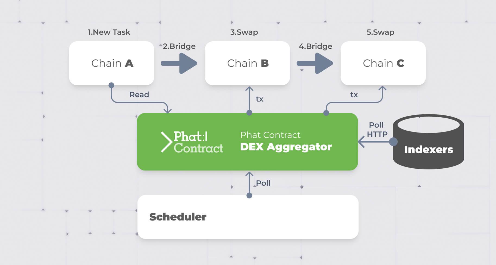
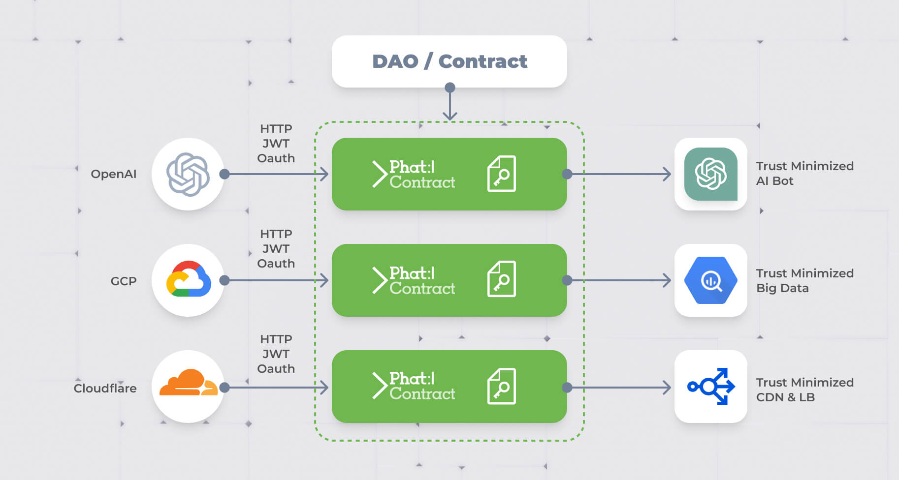
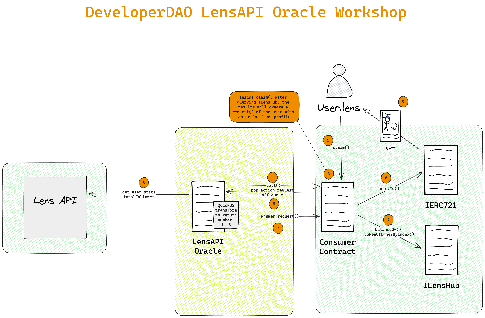
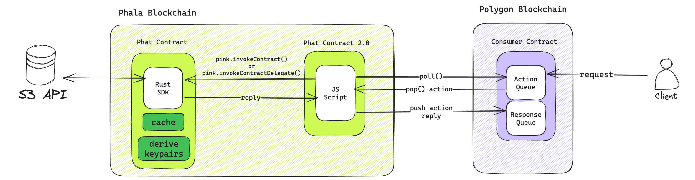

# Phala's Oracle Starter Kit
The Oracle Starter Kit is suitable to connect any API to your smart contract. It supports all EVM-compatible blockchains including Ethereum, Polygon, Arbitrum, Avalanche, Binance Smart Chain, Optimism and zkSync.

Using this starter kit allows you to initiate the data request from smart contract side. The request is transparently sent to your script for processing. You are free to call any APIs to fulfill the request. Finally, you can freely define the response data structure that will be replied to your smart contract.

## Features

- Wide support for all mainstream blockchains
- **Verifiable and decentralized**: every Oracle is running on decentralized infrastructure that require no operations and can be easily verified

- **Support private data**: your Oracle state is protected by cryptography and hardware

- **No extra cost**: the only cost is the gas fee of response data which is sent as a transaction
- **High frequency**: the request is synced to Oracle within one minute, and the latency of response is only limited by blockchain’s block interval

## Use cases & Examples

You could use the Oracle to:
- **Cross-chain DEX Aggregator**

- **Bring Web2 services & data on-chain**

- **Web3 Social Integrations**
  - [LensAPI Oracle](https://github.com/Phala-Network/lensapi-oracle-consumer-contract)
  
  - Mint NFT based on LensAPI Oracle data
  
  - [Lens Treasure Hunt](https://github.com/HashWarlock/lensapi-oracle-devdao-workshop)
  
- [Get Randomness on-chain from drand.love and post with Telegram bot](https://github.com/HashWarlock/phat-drand-tg-bot)

- **Trustless HTTPS requests** w/ [TLSNotary](https://tlsnotary.org/) integration
- **Connect to Phat Contract Rust SDK** to access all features

## Resources
- [What’s Oracle](https://ethereum.org/en/developers/docs/oracles/)
- Frontend Templates
  - [Scaffold ETH2](https://github.com/scaffold-eth/scaffold-eth-2)
    - [Phat Scaffold ETH2](https://github.com/HashWarlock/phat-scaffold-eth)
  - [Create ETH App](https://github.com/paulrberg/create-eth-app)
  - [Nexth Starter Kit](https://nexth.vercel.app/)
- [Technical design doc](https://github.com/Phala-Network/phat-offchain-rollup)
