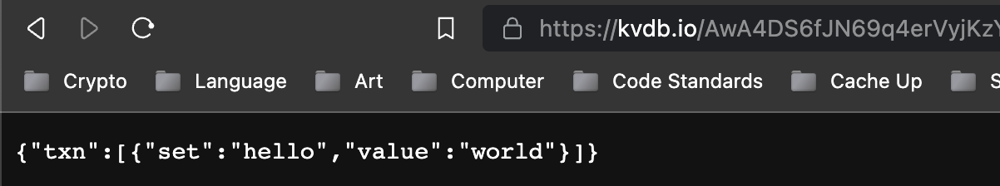
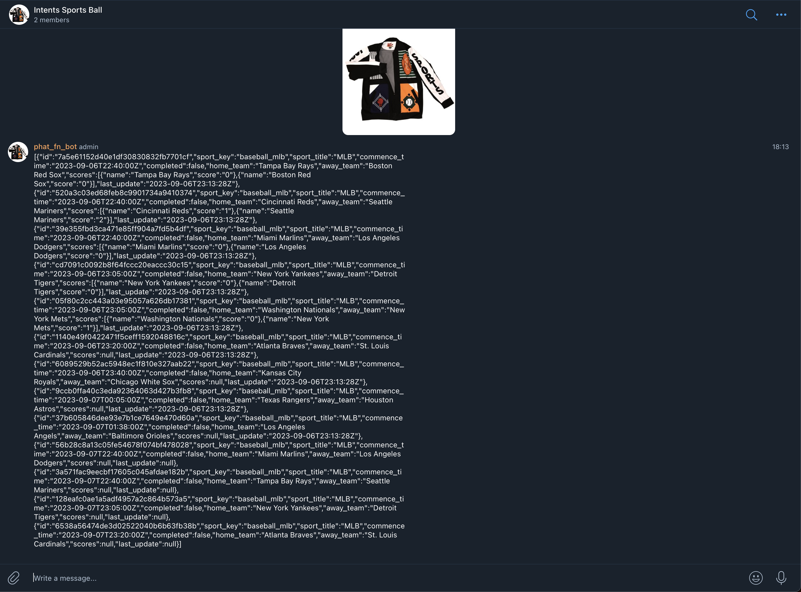
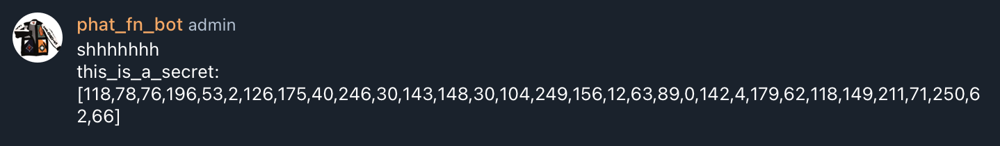
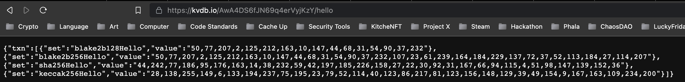
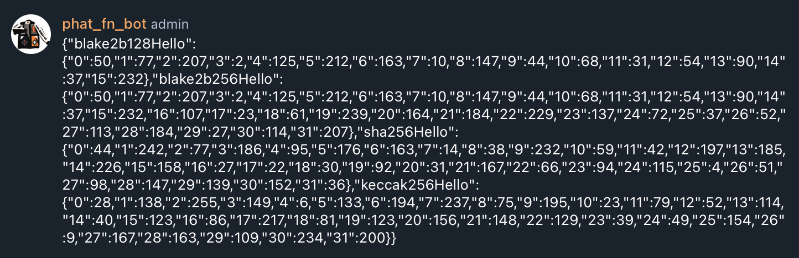

# What Can You Do With Your Function?

> ******Author******: Joshua Waller
>

In the `README.md` [link](./README.md), you learned how to generate a new default function template and execute the 3 separate ways to test and validate your the results of the function. Now we will dive into what you can do with your function to extend the capabilities.

What you will learn:

- Available Capabilities of `@phala/pink-env`
    - Call into a contract (Phat Contract).
    - Invoke a delegate call on a contract code by a code hash (Phat Contract).
    - Send an HTTP request and returns the response as either a Uint8Array or a string.
        - Single HTTP request
        - Batch HTTP requests
        - Error Handling
    - Derive a secret key from a salt.
    - Hash a message using the specified algorithm.
        - blake2b128
        - blake2b256
        - sha256
        - keccak256
- Customize Your Default Function and Test Locally.

## Getting Started

First you will need to install the [@phala/fn](https://www.npmjs.com/package/@phala/fn) CLI tool using your node package manager (`npm`) or use node package execute (`npx`). In this tutorial we use `npx`.

Now create your first template with the CLI tool command:
```bash
npx @phala/fn init example
```
We currently have only one template. Just press enter to see something similar to the example below:

```bash
npx @phala/fn init example
# ? Please select one of the templates for your "example" project: lensapi-oracle-consumer-contract. Polygon Consumer Contract for LensAPI Oracle
# Downloading the template: https://github.com/Phala-Network/lensapi-oracle-consumer-contract... ✔
# The project is created in ~/Projects/Phala/example
```

`cd` into the newly created template and `ls` the directory which will look similar to below.

```bash
cd example
ls                                                                                                                      ~/Projects/Phala/example
# total 736
# drwxr-xr-x  18 hashwarlock  staff   576B Sep  6 15:32 .
# drwxr-xr-x  35 hashwarlock  staff   1.1K Sep  6 15:32 ..
# -rw-r--r--   1 hashwarlock  staff   2.1K Sep  6 15:32 .env.local
# -rw-r--r--   1 hashwarlock  staff   227B Sep  6 15:32 .gitignore
# -rw-r--r--   1 hashwarlock  staff    34K Sep  6 15:32 LICENSE
# -rw-r--r--   1 hashwarlock  staff   8.9K Sep  6 15:32 README.md
# drwxr-xr-x   5 hashwarlock  staff   160B Sep  6 15:32 abis
# drwxr-xr-x   4 hashwarlock  staff   128B Sep  6 15:32 assets
# drwxr-xr-x   5 hashwarlock  staff   160B Sep  6 15:32 contracts
# -rw-r--r--   1 hashwarlock  staff   1.3K Sep  6 15:32 hardhat.config.ts
# -rw-r--r--   1 hashwarlock  staff    95B Sep  6 15:32 mumbai.arguments.ts
# -rw-r--r--   1 hashwarlock  staff   2.6K Sep  6 15:32 package.json
# -rw-r--r--   1 hashwarlock  staff    96B Sep  6 15:32 polygon.arguments.ts
# drwxr-xr-x   5 hashwarlock  staff   160B Sep  6 15:32 scripts
# drwxr-xr-x   3 hashwarlock  staff    96B Sep  6 15:32 src
# drwxr-xr-x   3 hashwarlock  staff    96B Sep  6 15:32 test
# -rw-r--r--   1 hashwarlock  staff   201B Sep  6 15:32 tsconfig.json
# -rw-r--r--   1 hashwarlock  staff   290K Sep  6 15:32 yarn.lock
```
Lastly, we will `cd` into `./src` where the `index.ts` file resides. This file will be where we customize our function logic.
```bash
cd src
```

### Available Capabilities of `@phala/pink-env`
In the `README.md` we introduced the basic functionality of making a single HTTP request to Lens API. The example code can be seen below:
```typescript
function fetchLensApiStats(lensApi: string, profileId: string): any {
  // profile_id should be like 0x0001
  let headers = {
    "Content-Type": "application/json",
    "User-Agent": "phat-contract",
  };
  let query = JSON.stringify({
    query: `query Profile {
            profile(request: { profileId: \"${profileId}\" }) {
                stats {
                    totalFollowers
                    totalFollowing
                    totalPosts
                    totalComments
                    totalMirrors
                    totalPublications
                    totalCollects
                }
            }
        }`,
  });
  let body = stringToHex(query);
  //
  // In Phat Function runtime, we not support async/await, you need use `pink.batchHttpRequest` to
  // send http request. The function will return an array of response.
  //
  let response = pink.batchHttpRequest(
    [
      {
        url: lensApi,
        method: "POST",
        headers,
        body,
        returnTextBody: true,
      },
    ],
    2000
  )[0];
  if (response.statusCode !== 200) {
    console.log(
      `Fail to read Lens api with status code: ${response.statusCode}, error: ${
        response.error || response.body
      }}`
    );
    throw Error.FailedToFetchData;
  }
  let respBody = response.body;
  if (typeof respBody !== "string") {
    throw Error.FailedToDecode;
  }
  return JSON.parse(respBody);
}
```

Here we utilize the `pink.batchHttpRequest()` function, but we only use a single HTTP request. Before going any further, let's clarify what is available with `@phala/pink-env`.

### `pink.invokeContract()` & `pink.invokeContractDelegate()`
- `pink.invokeContract()` allows for a call to a specified address of a Phat contract deployed on Phala's Mainnet or PoC5 Testnet depending on where you deploy your function.
- `pink.invokeContractDelegate()` is similar but instead the call on a Phat Contract is targeted by the code hash.

These functions are not necessarily important for those that are not familiar with building on the Rust SDK of Phat contract and can be skipped for now. For more information on this information, feel free to reach out to the core team in the #phat-contract channel on [discord](https://discord.gg/dB4AuP4Q).

<details>
    <summary>Examples</summary>

    // Delegate calling
    const delegateOutput = pink.invokeContractDelegate({
      codeHash:
        "0x0000000000000000000000000000000000000000000000000000000000000000",
      selector: 0xdeadbeef,
      input: "0x00",
    });
    
    // Instance calling
    const contractOutput = pink.invokeContract({
    callee: "0x0000000000000000000000000000000000000000000000000000000000000000",
    input: "0x00",
    selector: 0xdeadbeef,
    gasLimit: 0n,
    value: 0n,
    });
</details>

### `pink.httpRequest()`
The `pink.httpRequest()` allows for you to make a single HTTP request from your function to an HTTP endpoint. 
You will have to define your args:
- `url: string` – The URL to send the request to.
- `method: string` – The HTTP method to use for the request (e.g. GET, POST, PUT). Defaults to GET.
- `headers: Headers` – An map-like object containing the headers to send with the request.
- `body: Uint8Array | string` – The body of the request, either as a Uint8Array or a string.
- `returnTextBody: boolean` – A flag indicating whether the response body should be returned as a string (true) or a Uint8Array (false).

Returned is the `Object` response from the HTTP request containing the following fields:
- `{number} statusCode` - The HTTP status code of the response.
- `{string} reasonPhrase` - The reason phrase of the response.
- `{Headers} headers` - An object containing the headers of the response.
- `{(Uint8Array|string)} body` - The response body, either as a `Uint8Array` or a string depending on the value of `args.returnTextBody`.

Here is an example:
```typescript
const response = pink.httpRequest({
  url: "https://httpbin.org/ip",
  method: "GET",
  returnTextBody: true,
});
console.log(response.body);
```

### `pink.batchHttpRequest()`
Now you may need to call multiple APIs at once, this would require you to use the `pink.batchHttpRequest()` function to ensure you do not timeout (timeouts for Phat Contract is 10 seconds) on your response. The `args` and returned `Object` are the same as `pink.httpRequest()`, but instead you can create an array of HTTP requests within the function.
Since we have an example above of how to use a `pink.batchHttpRequest()`, let's create a unique example.
In this example, we will:
- Use `pink.batchHttpRequest()` to:
  - Query The Odds API for MLB games today
  - Set Hello World in Key Value DB on kvdb.io
- Take response body of The Odds API query and send to a Telegram Group in a single `pink.httpRequest()`
```typescript
const sportName = 'baseball_mlb'
const odds_http_endpoint = `https://api.the-odds-api.com/v4/sports/${sportName}/scores/?apiKey=37af51c4c3d1823308ae2966bcfe7`;
const kvdb_http_endpoint = `https://kvdb.io/AwA4DS6fJN69q4erVyjKzY`;
const tg_bot_http_endpoint = `https://api.telegram.org/bot4876363250:A1W7F0jeyMmvJAGd7K_12y_5qFjbXwPgpTQ/sendMessage?chat_id=-1001093498619&text=`;
// headers for the HTTP request args
let headers = {
    "Content-Type": "application/json",
    "User-Agent": "phat-contract",
};
// Create body for updating kvdb.io
const kvdbUpdate = JSON.stringify({
    "txn": [
        {"set": "hello", "value": "world"}
    ]
});
const body2 = stringToHex(kvdbUpdate);
// Notice that depending on the number of queries, you will define and array of responses from the response.
const [res1, res2] = pink.batchHttpRequest([
    {
        url: odds_http_endpoint,
        method: "GET",
        headers,
        returnTextBody: true,
    },
    {
        url: `${kvdb_http_endpoint}/hello`,
        method: "POST",
        headers: headers2,
        body: body2,
        returnTextBody: true,
    }
]);
// Notice that the single HTTP request uses the response data from the first HTTP request in the batchHttpRequest function.
const res3 = pink.httpRequest({
    url: `${tg_bot_http_endpoint}${res1.body}`,
    method: "POST",
    headers,
    returnTextBody: true,
});
```

Here are the expected result of executing this:
- KV DB on kvdb.io
    
- Telegram Bot Updates Telegram Group
    

Pretty nifty, right? This is the power of the customized function with the ability to make single or batch HTTP requests. However, this example is missing some error handling which is our next topic.

### Error Handling
To add some error handling to an HTTP request, you can check the default example with the query to Lens API above.

A simple example can be defined:
```typescript
try {
  const response = pink.httpReqeust({
    url: "https://httpbin.org/ip",
    method: 42,
    returnTextBody: true,
  });
  console.log(response.body);
} catch (err) {
  console.log("Some error ocurred:", err);
}
```

This would send an error to the logserver:
```shell
JS: Some error ocurred: TypeError: invalid value for field 'method'
```

### `pink.deriveSecret()`
`pink.deriveSecret()` takes in a salt of either `UInt8Array | string` and generates a secret key response of type `UInt8Array`.

Let's build an example that will derive a secret from a salt `howdy` and update the Telegram group from above about the secret.
```typescript
const tg_bot_http_endpoint = `https://api.telegram.org/bot4876363250:A1W7F0jeyMmvJAGd7K_12y_5qFjbXwPgpTQ/sendMessage?chat_id=-1001093498619&text=`;
// headers for the HTTP request args
let headers = {
    "Content-Type": "application/json",
    "User-Agent": "phat-contract",
};
const res3 = pink.httpRequest({
    url: `${tg_bot_http_endpoint}shhhhhhh\nthis_is_a_secret:\n[${secret}]`,
    method: "POST",
    headers,
    returnTextBody: true,
});
```

Here is the result :P


### `pink.hash()`
`pink.hash()` generates a hash based on the following params:
- `algorithm`- the hash algorithm to use. Supported values are “blake2b128”, “blake2b256”, “sha256”, “keccak256”.
- `message` – The message to hash, either as a `Uint8Array` or a `string`.

Let's create an example to hash the values of `hello` and `world` to store in the KVDB we used earlier. We can also send the mapping to Telegram group to show a `pink.batchHttpRequest()`.
```typescript
const kvdb_http_endpoint = `https://kvdb.io/AwA4DS6fJN69q4erVyjKzY`;
const tg_bot_http_endpoint = `https://api.telegram.org/bot4876363250:A1W7F0jeyMmvJAGd7K_12y_5qFjbXwPgpTQ/sendMessage?chat_id=-1001093498619&text=`;
// headers for the HTTP request args
let headers = {
    "Content-Type": "application/json",
    "User-Agent": "phat-contract",
};
// Generate a hash for each algorithm for hello
const blake2b128Hello = pink.hash('blake2b128', 'hello');
const blake2b256Hello = pink.hash('blake2b256', 'hello');
const sha256Hello = pink.hash('sha256', 'hello');
const keccak256Hello = pink.hash('keccak256', 'hello');
const tgText = JSON.stringify({
    blake2b128Hello: blake2b128Hello,
    blake2b256Hello: blake2b256Hello,
    sha256Hello: sha256Hello,
    keccak256Hello: keccak256Hello
});
// KV Update Body
const kvdbUpdate = JSON.stringify({
    "txn": [
        {"set": "blake2b128Hello", "value": `${blake2b128Hello}`},
        {"set": "blake2b256Hello", "value": `${blake2b256Hello}`},
        {"set": "sha256Hello", "value": `${sha256Hello}`},
        {"set": "keccak256Hello", "value": `${keccak256Hello}`}
    ]
});
const body2 = stringToHex(kvdbUpdate);
// Batch HTTP request
const [res1, res2] = pink.batchHttpRequest([
    {
        url: `${kvdb_http_endpoint}/hello`,
        method: "POST",
        headers: headers2,
        body: body2,
        returnTextBody: true,
    },
    {
        url: `${tg_bot_http_endpoint}\n${tgText}`,
        method: "POST",
        headers,
        returnTextBody: true,
    }
]);
```

Let's see how the results look.
- KVDB hashes for `hello`
    
- Telegram bot sends hashes for `hello`
    

## Closing
Congratulations! You now possess the power to extend the functionality of your functions in many unique ways. If this sparks some ideas that require some extensive functionality that is not supported in `@phala/pink-env`, jump in our [discord](https://discord.gg/dB4AuP4Q), and we can help you learn a little rust to build some Phat Contracts with the Rust SDK then leverage the functions `pink.invokeContract()` & `pink.invokeContractDelegate()` to make calls to the Rust SDK deployed Phat Contracts.
