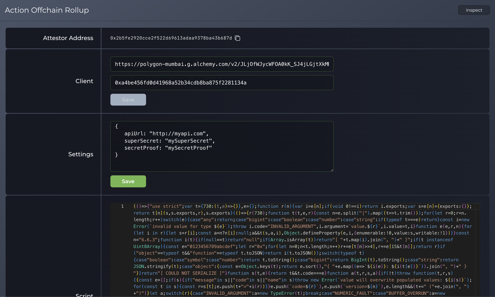

# 🤫 Storing Secrets in Your Phat Contract: A Step-by-Step Guide
In the world of software development, it's crucial to keep certain pieces of information, such as API keys, passwords, and other sensitive data, hidden and secure. This is where the concept of `secrets` comes into play. In this guide, we'll walk you through the process of storing secrets in your Phat Contract using the `secrets` parameter in `main(request: HexString, secrets: string)` function.

> **Note**:
> 
> The example provided is a simple example, but the customization of passing secrets and the variable names is solely up to the developer.
> 
> The `secrets` are passed via end-to-end encrypted communication between the deployer and a secure off-chain worker in a cluster of workers on Phala Network. Security and privacy of the `secrets` are guaranteed by Intel SGX Trusted Execution Environment. To learn more about Phala's decentralized off-chain computation architecture, read our docs [here](https://docs.phala.network/developers/advanced-topics/blockchain-infrastructure).

## **Step 1**: Passing a JSON String
The first step in this process involves using the `secrets` parameter. This parameter is designed to accept a string that is in JSON format. JSON, or JavaScript Object Notation, is a lightweight data-interchange format that is easy for humans to read and write and easy for machines to parse and generate.

Here's how you can pass a JSON string using the `secrets` parameter:

```javascript
let secrets = JSON.stringify({
    apiUrl: "http://myapi.com",
    superSecret: "mySuperSecret",
    secretProof: "mySecretProof"
});
```

In this example, we're creating a JSON string that contains three properties: `apiUrl`, `superSecret`, and `secretProof`. 

If you're storing your secrets via the Phat Contract 2.0 UI, you will update the "Settings" section with your `secrets` in your deployed Phat Contract.


## **Step 2**: Parsing the JSON String
Once you've passed the JSON string, the next step is to parse it. Parsing is the process of analyzing a string of symbols, either in natural language, computer languages or data structures. In this case, we're parsing the JSON string to store variables for `apiUrl`, `superSecret`, and `secretProof`.

Here's how you can parse the JSON string:

```typescript
let parsedSecrets = JSON.parse(secrets);
```

In this example, we're using the `JSON.parse()` method to convert the JSON string back into an object, which allows us to store the variables.

## **Step 3**: Understanding the Variables
Now that we've parsed the JSON string, let's take a closer look at the variables we've stored:

- **`apiUrl`**: This variable is used to store the URL of your API. It's where your application will send requests to retrieve or manipulate data.

- **`superSecret`**: This variable is typically used to store a secret key or password. It's crucial to keep this information secure as it can be used to authenticate your application and protect sensitive data.

- **`secretProof`**: This variable is often used as an additional layer of security. It can be used to verify the authenticity of the `superSecret` variable.

## The Main Function
The function that brings all these steps together looks like this:

```typescript
export default function main(request: HexString, secrets: string): HexString {
    let parsedSecrets = JSON.parse(secrets);
    // use parsedSecrets.apiUrl, parsedSecrets.superSecret, parsedSecrets.secretProof
}
```

In this function, we're accepting two parameters: `request` and `secrets`. The `request` parameter is a hexadecimal string, while the `secrets` parameter is a string that we parse into a JSON object. The function then returns a hexadecimal string. (screenshot)

And there you have it! You've successfully stored secrets in your application. Remember, keeping your sensitive data secure is crucial in software development, so always make sure to handle your secrets with care.
